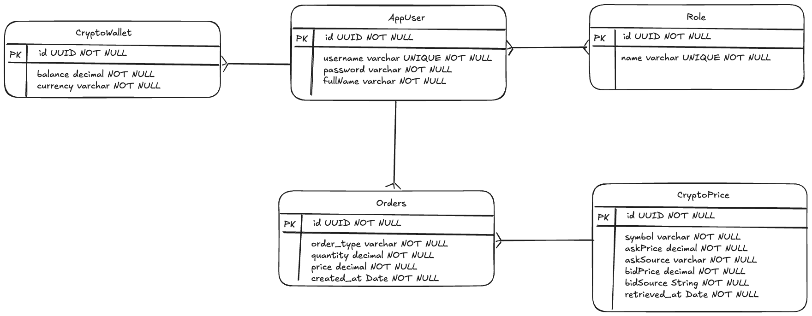

# Table Design



# API

## Login to the system and retrieve JWT token

User has already been created with the username `user` and password `password`. Use the following endpoint to login and
retrieve the JWT token.
Attached them as `Authorization: Bearer <token>` in the header for all the requests.

### Request

*/api/auth/login*

```json
{
  "username": "user",
  "password": "password"
}
```

### Response

```json
{
  "token": jwttoken
}
```

## Get latest aggregated quotes

Get the latest aggregated quotes for all the support crypto pairs.

### Request

*/api/quotes*

### Response

```json
[
  {
    "symbol": "ETHUSDT",
    "askPrice": 2911.60,
    "bidPrice": 2911.59
  },
  {
    "symbol": "BTCUSDT",
    "askPrice": 75966.96,
    "bidPrice": 75976.86
  }
]
```

## Trade a crypto pair

### Request

*/api/trade*

```json
{
  "symbol": "ETHUSDT",
  "orderType": "BUY",
  "quantity": 1
}
```

### Response

```json
{
  "message": "Order placed successfully",
  "status": true
}
```

## Get wallets balance

Get the wallets of the current user

### Request

*/api/profile/wallets*

Optionally provide the following parameters for pagination

1. pageSize (default 10)
2. pageNum (default 0)
3. sortBy (default currency)
4. sortOrder (default desc)

### Response

```json
{
  "data": [
    {
      "id": "697cf5cc-d218-463d-bb27-6ec71467504d",
      "balance": 49708.92,
      "cryptoCurrency": "USDT"
    },
    {
      "id": "fe8c9c32-3388-4086-aba1-ece5e8925be6",
      "balance": 0.10,
      "cryptoCurrency": "ETH"
    }
  ],
  "pageSize": 10,
  "pageNumber": 0,
  "totalPages": 1,
  "totalElements": 2,
  "last": true
}
```

## Get trade history

Get the trade history of the current user

### Request

*/api/profile/trades*

Optionally provide the following parameters for pagination

1. pageSize (default 10)
2. pageNum (default 0)
3. sortBy (default createdAt)
4. sortOrder (default desc)

### Response

```json
{
  "data": [
    {
      "symbol": "ETHUSDT",
      "quantity": 0.10,
      "orderType": "BUY",
      "price": 291.15
    },
    {
      "symbol": "ETHUSDT",
      "quantity": 0.10,
      "orderType": "BUY",
      "price": 291.09
    }
  ],
  "pageSize": 10,
  "pageNumber": 0,
  "totalPages": 1,
  "totalElements": 2,
  "last": true
}
```